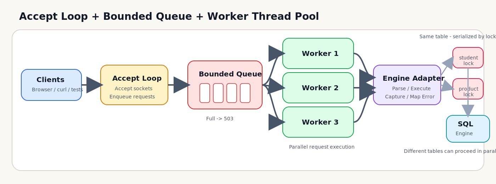
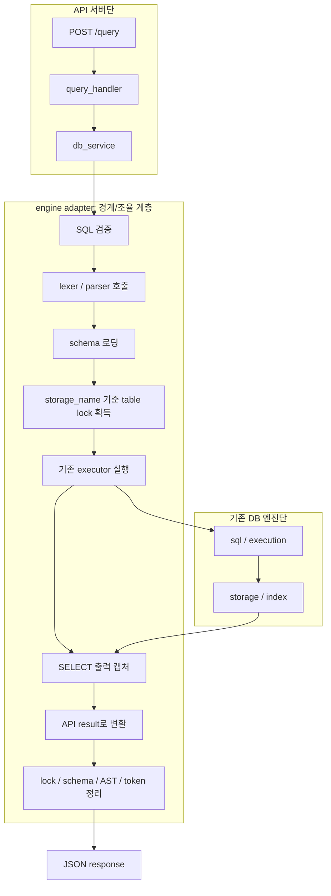

# 정글 미니 DBMS API 서버

8주차에서는 기존 7주차 SQL 처리기와 B+ 트리 인덱스를 재사용하고, 그 바깥에 HTTP API 서버와 병렬 요청 처리 구조를 추가하여 구현하였습니다.

(참고) 세부 설명 [week8-readme-details.md](learning-docs/week8-readme-details.md).

*문서 우선순위: `architecture.md > api-spec.md > requirements.md > README.md`

## 핵심 시각화



요청은 `accept loop -> bounded queue -> worker thread pool` 구조로 분배됩니다.


같은 물리 테이블 요청은 직렬화하고, 다른 테이블 요청은 병렬 처리합니다.

## 핵심 포인트

- 기존 SQL 처리기와 B+ 트리를 버리지 않고 그대로 재사용했습니다.
- `accept loop + bounded queue + worker thread pool` 구조로 요청을 병렬 처리합니다.
- 같은 물리 테이블은 `storage_name` 기준 락으로 직렬화합니다.
- `GET /`, `GET /health`, `POST /query` 엔드포인트를 제공합니다.
- `WHERE id = ...` 조회는 기존 B+ 트리 인덱스 경로를 유지합니다.
- 자동 테스트로 정상/오류/경계값/동시성 시나리오를 검증했습니다.

## 구현한 것

- `GET /`, `GET /health`, `POST /query`
- 브라우저용 SQL 입력 화면
- `1 connection = 1 request` 기반 최소 HTTP 서버
- `Content-Length` 기반 JSON 요청 처리
- bounded queue 기반 요청 적재와 queue full 시 `503` 반환
- worker thread pool 기반 병렬 요청 처리
- 같은 테이블 직렬화, 다른 테이블 병렬 처리
- 기존 `lexer`, `parser`, `executor`, `storage`, `index` 재사용
- `WHERE id = ...` 조회 시 B+ 트리 인덱스 사용

## 구현하지 않은 것

- HTTP keep-alive: 요청 1건 처리 후 연결을 재사용하지 않고 바로 종료하는 현재 구조에서는 지원하지 않습니다.
- HTTP pipelining: 하나의 연결에서 요청 여러 개를 연속 처리하는 구조를 구현하지 않았습니다.
- `Transfer-Encoding: chunked`: 현재는 `Content-Length` 기반 고정 길이 body만 읽습니다.
- transaction: 다중 쿼리를 원자적으로 묶는 트랜잭션 기능은 범위에 포함하지 않았습니다.
- authentication: 사용자 인증과 권한 검사는 구현하지 않았습니다.
- 구조화된 row 배열 응답: 조회 결과는 JSON row 배열 대신 기존 엔진의 표 문자열을 그대로 반환합니다.
- `UPDATE`, `DELETE`, `JOIN`, `ORDER BY`, `GROUP BY`: 이번 과제 범위를 넘어서는 SQL 기능은 지원하지 않습니다.
- `AND`, `OR` 를 포함한 복합 `WHERE`: 현재 parser는 단일 조건 `WHERE` 만 지원합니다.

## 구조 요약

```text
client
  -> server
  -> http
  -> api
  -> service
  -> engine adapter
  -> sql / execution
  -> storage / index
```

- `server`: 소켓, accept loop, queue, worker pool을 관리합니다.
- `http`: request/header/body 파싱과 HTTP 응답 생성을 담당합니다.
- `api`: 엔드포인트별 요청 검증과 응답 변환을 담당합니다.
- `service`: API와 엔진 사이의 얇은 경계 계층입니다.
- `engine adapter`: 기존 SQL 엔진 연결, 락, 출력 캡처, 오류 변환을 담당합니다.

`engine adapter`는 기존 엔진을 직접 다시 구현하지 않고, SQL 실행에 필요한 단계들을 아래 순서로 조율합니다.



세부 구조 설명은 [week8-readme-details.md](learning-docs/week8-readme-details.md) 와 [아키텍처 문서](docs/week8-architecture.md)를 참고하세요.

## 빠른 실행

빌드:

```bash
make all
```

서버 실행:

```bash
./build/bin/sqlapi_server \
  --host 127.0.0.1 \
  --port 8080 \
  --worker-count 4 \
  --queue-capacity 64 \
  --schema-dir schema \
  --data-dir data
```

빠른 확인:

- 브라우저: `http://127.0.0.1:8080/`
- health check: `curl -i http://127.0.0.1:8080/health`
- 테스트 실행: `make test`

자동 테스트 기준 최신 요약은 `Tests run: 387`, `Tests failed: 0` 입니다. 세부 범위는 [테스트 계획서](docs/week8-test-plan.md)와 [week8-readme-details.md](learning-docs/week8-readme-details.md)에 정리했습니다.

## 상세 설명과 보조 자료

- [README 상세 설명](learning-docs/week8-readme-details.md)
- [8주차 API 서버 코드 리뷰 가이드](learning-docs/week8-api-server-review-guide.md)
- [8주차 코드 읽기 체크리스트](learning-docs/week8-code-reading-checklist.md)
- [요구사항 정의서](docs/week8-requirements.md)
- [아키텍처 문서](docs/week8-architecture.md)
- [API 명세서](docs/week8-api-spec.md)
- [테스트 계획서](docs/week8-test-plan.md)
