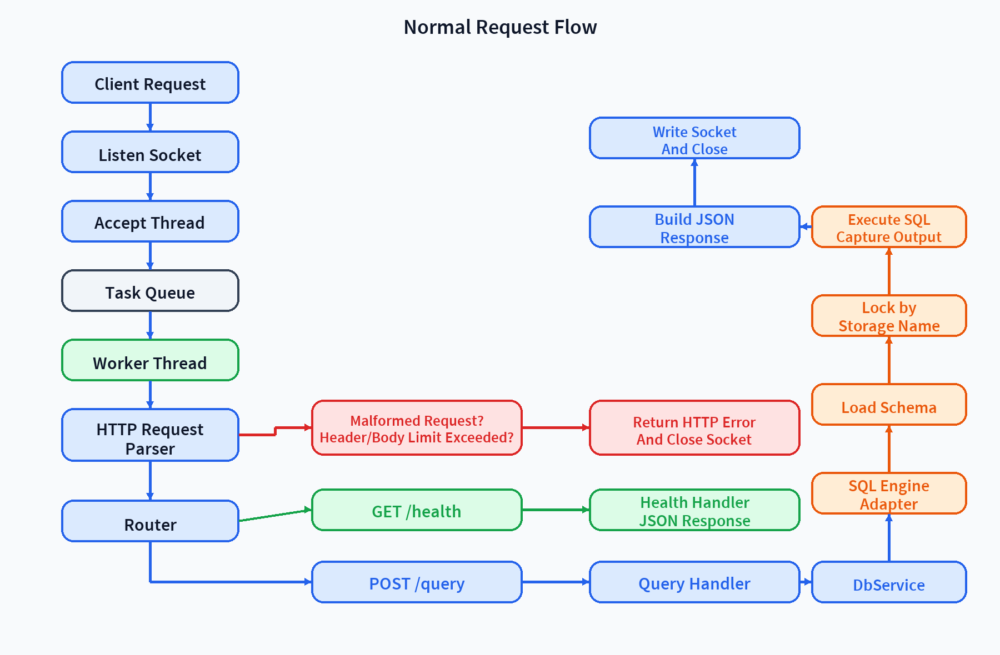
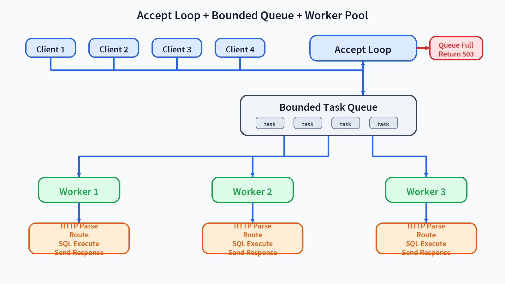

# 정글 미니 DBMS API 서버

## 1. 프로젝트 개요

이 저장소는 8주차 수요 코딩회 과제인 `미니 DBMS - API 서버` 구현 결과물입니다.
현재 구현은 8주차 과제 범위에 맞춘 최소 구현입니다.

이번 구현의 핵심 목표는 다음과 같습니다.

- 7주차에 만든 SQL 처리기와 B+ 트리 인덱스를 내부 DB 엔진으로 재사용한다.
- 외부 클라이언트가 네트워크 API를 통해 DBMS 기능을 호출할 수 있게 한다.
- `accept loop + bounded queue + worker thread pool` 구조로 병렬 요청을 처리한다.
- 같은 테이블에 대한 요청은 직렬화하고, 다른 테이블은 병렬 처리해 정합성과 처리량을 함께 확보한다.
- README만으로 구조, 실행 방법, 테스트 범위, 현재 한계를 설명할 수 있게 한다.

세부 설계와 계약은 아래 문서를 기준으로 구현했습니다.

- [요구사항 정의서](docs/week8-requirements.md)
- [아키텍처 문서](docs/week8-architecture.md)
- [API 명세서](docs/week8-api-spec.md)
- [테스트 계획서](docs/week8-test-plan.md)

문서 우선순위는 `architecture.md > api-spec.md > requirements.md > README.md`입니다.

## 2. 요구사항 대응 요약

| 공지 요구사항 | 구현/설계 대응 | 근거 |
| --- | --- | --- |
| 구현한 API를 통해 외부 클라이언트에서 DBMS 기능을 사용할 수 있어야 합니다. | `HTTP/1.1 over TCP` 기반으로 `GET /`, `GET /health`, `POST /query`를 제공하고, 브라우저 진입 페이지는 SQL을 입력받아 `POST /query`를 호출하고 결과를 표시하는 얇은 프론트엔드로 구성했습니다. | `docs/week8-api-spec.md`, `src/api/`, `src/http/` |
| 스레드 풀(Thread Pool)을 구성하고, 요청이 들어올 때마다 스레드를 할당하여 SQL 요청을 병렬로 처리해야 합니다. | `accept loop + bounded queue + worker thread pool` 구조를 사용하고, accept thread가 연결을 큐에 적재한 뒤 worker가 요청 하나를 처리하는 `1 connection = 1 request` 모델로 운영합니다. | `docs/week8-architecture.md`, `src/server/server.c`, `src/server/task_queue.c`, `src/server/worker_pool.c` |
| 이전 차수에서 구현한 SQL 처리기와 B+ 트리 인덱스를 그대로 활용하여 내부 DB 엔진을 구성합니다. | 기존 `lexer`, `parser`, `executor`, `storage`, `index` 계층을 내부 엔진으로 재사용하고, API 서버는 `sql_engine_adapter`와 `db_service`를 통해 기존 엔진 바깥에 얹었습니다. | `docs/week8-requirements.md`, `docs/week8-architecture.md`, `src/sql/`, `src/execution/`, `src/storage/`, `src/index/`, `src/engine/sql_engine_adapter.c` |
| 이전 차수에서 구현한 SQL 처리기와 B+ 트리 인덱스를 그대로 활용하여 내부 DB 엔진을 구성합니다. | 기존 B+ 트리 인덱스를 활용하는 조회 경로를 API 서버 환경에서도 유지합니다. 현재 구현에서는 `WHERE id = ...` 조회가 인덱스 경로를 사용하고, 필요 시 기존 index 계층의 CSV 기반 rebuild 복구 흐름을 그대로 따릅니다. | `docs/week8-requirements.md`, `docs/week8-architecture.md`, `src/index/table_index.c`, `src/execution/executor.c` |
| 멀티 스레드 동시성 이슈를 고려해야 합니다. | 서로 다른 테이블은 병렬 처리하고, 같은 물리 테이블은 `schema.storage_name` 기준 `table-level exclusive lock`으로 직렬화합니다. 전역 인덱스 레지스트리는 별도 `registry_mutex`로 보호합니다. | `docs/week8-architecture.md`, `src/engine/engine_lock_manager.c`, `src/index/table_index.c` |
| API 서버 아키텍쳐와 내부 DB 엔진과 외부 API 서버 사이 연결을 설계해야 합니다. | `client -> server -> http -> api -> service -> engine adapter -> sql/execution/storage/index` 계층 구조를 유지하고, controller 성격의 API 계층이 저장소를 직접 건드리지 않도록 분리했습니다. | `docs/week8-architecture.md`, `README 3장`, `src/api/`, `src/service/`, `src/engine/` |
| 단위 테스트, API 기능 테스트, 엣지 케이스를 최대한 고려해야 합니다. | 엔진 회귀 테스트, CLI 테스트, API 통합 테스트를 하나의 테스트 타깃으로 운영하고, HTTP 형식 오류, SQL 오류, queue full, shutdown, 재시작 복구, 경계값 통과/초과를 자동 검증합니다. | `docs/week8-test-plan.md`, `tests/test_runner.c`, `tests/test_api_server.c` |
| 발표자료는 따로 만들지 않고, README.md를 기준으로 설명합니다. | README에 구조, 실행 방법, 테스트 범위, 예외 처리, 데이터 흐름, 다이어그램을 모아 발표용 문서 역할을 하도록 구성했습니다. | `README.md`, `docs/images/` |

## 3. 시스템 구조

### 3.1 계층 구조

```text
client
  -> server
  -> http
  -> api
  -> service
  -> engine adapter
  -> sql / execution
  -> storage / index
```

이 구조는 “브라우저나 curl이 보낸 요청이 어디를 어떻게 거쳐서 SQL 실행까지 내려가는가”를 층별로 단순화해서 그린 것입니다. 

각 계층은 자기 책임만 수행한 뒤 요청을 아래로 넘기고, 결과는 다시 위로 올립니다.

```
client는 외부 호출자입니다. 브라우저, curl, 테스트 코드가 여기에 해당합니다. 이 계층은 HTTP 요청을 만들고 응답을 받는 역할만 합니다. 내부적으로 SQL 파서나 CSV 파일을 직접 알 필요는 없습니다.

server는 네트워크 런타임 계층입니다. 소켓을 열고 bind/listen/accept를 수행하고, 들어온 연결을 작업 큐에 넣고, worker thread가 그 연결을 처리하게 만듭니다. 즉 “연결을 받고 분배하는 곳”입니다. 여기서는 SQL을 해석하지 않고, 요청 1건을 처리 가능한 실행 문맥으로 넘기는 데 집중합니다. 관련 코드는 src/server/server.c입니다.

http는 HTTP 프로토콜 처리 계층입니다. 서버가 받은 바이트 스트림을 HTTP/1.1 요청으로 파싱하고, request line, header, body, Content-Length, Content-Type 같은 형식 검증을 수행합니다. 반대로 응답을 보낼 때는 상태 코드, 헤더, JSON/HTML body를 조립합니다. 즉 “네트워크 바이트를 HTTP 의미 구조로 바꾸는 계층”입니다. 관련 코드는 src/http/http_request.c, src/http/http_response.c, src/http/router.c입니다.

api는 엔드포인트별 요청 처리 계층입니다. 예를 들어 GET /, GET /health, POST /query가 각각 어떤 동작을 해야 하는지 여기서 갈립니다. 중요한 점은 이 계층이 비즈니스 로직을 직접 처리하지 않는다는 것입니다. POST /query라면 JSON에서 sql 필드를 꺼내고, 잘못된 입력이면 적절한 오류를 만들고, 정상 입력이면 서비스 계층으로 넘깁니다. 즉 “HTTP 엔드포인트를 애플리케이션 동작으로 연결하는 계층”입니다. 관련 코드는 src/api/root_handler.c, src/api/health_handler.c, src/api/query_handler.c입니다.

service는 API와 엔진 사이의 얇은 경계입니다. 현재 구현에서는 로직이 많지 않고 거의 위임만 하지만, 이 계층이 있기 때문에 API 핸들러가 엔진 세부 구조를 직접 알 필요가 없습니다. 나중에 정책 추가나 인증, 요청 추적, 공통 전처리 같은 것이 늘어나더라도 API 계층을 덜 건드리고 확장할 수 있습니다. 즉 “API 계층이 엔진에 직접 달라붙지 않게 하는 완충 지점”입니다. 관련 코드는 src/service/db_service.c입니다.

engine adapter는 API 서버 세계와 기존 SQL 엔진 세계를 연결하는 핵심 번역기입니다. 여기서 SQL 길이 검증, lexer/parser 호출, 대상 테이블 추출, load_schema() 호출, schema.storage_name 기준 락 획득, executor 실행, 출력 캡처, 오류 코드 분류가 일어납니다. 즉 “기존 7주차 엔진을 API 서버에서 안전하게 재사용할 수 있게 감싸는 계층”입니다. 관련 코드는 src/engine/sql_engine_adapter.c입니다.
```


### 3.2 계층별 역할

- `server`: 소켓 생성, `bind/listen/accept`, 작업 큐 적재, worker pool 제어, queue full 시 즉시 `503` 반환
- `http`: request line/header/body 파싱, HTTP 한도 검증, 라우팅, JSON 응답 생성
- `api`: 엔드포인트별 요청 검증, 루트 HTML 반환, 서비스 호출
- `service`: API 입력을 내부 SQL 실행 요청으로 위임하는 얇은 경계
- `engine adapter`: SQL 길이 검증, lexer/parser 호출, schema 로딩, 락 획득/해제, executor 호출, 출력 캡처, 오류 코드 분류
- `sql/execution/storage/index`: 7주차 SQL 엔진과 B+ 트리 인덱스 구현

### 3.3 핵심 설계 선택

- 서버 실행 모델은 `1 connection = 1 request`입니다.
- `GET /`는 브라우저용 HTML 진입 페이지를 반환합니다.
- `POST /query`는 `Content-Length` 기반 고정 길이 body만 지원합니다.
- keep-alive, pipelining, `Transfer-Encoding: chunked`는 지원하지 않습니다.
- 조회 결과는 구조화된 row 배열 대신 기존 엔진의 표 출력 문자열을 그대로 JSON `output`에 담습니다.

이 선택은 기존 엔진을 크게 흔들지 않으면서 API 서버를 바깥 계층으로 얹기 위한 최소 구현 전략입니다.

## 4. 데이터 흐름

### 4.1 정상 요청 흐름



정상 요청은 `accept thread -> task queue -> worker thread -> http/api/service/engine` 순서로 내려가고, `POST /query`는 엔진 어댑터 안에서 schema 로딩, 락 획득, SQL 실행, JSON 응답 생성까지 이어집니다. HTTP 형식 오류나 queue full 같은 예외는 가능한 한 앞단에서 바로 끊어 응답합니다.

### 4.2 동시성 제어가 걸리는 지점



핵심은 SQL 원문에 적힌 테이블명이 아니라 `load_schema()` 이후 확정되는 `schema.storage_name`을 락 키로 쓴다는 점입니다. 따라서 alias 이름으로 같은 물리 파일을 가리켜도 동일한 락으로 직렬화됩니다.

## 5. 기존 엔진 재사용 방식

이번 구현은 CLI 진입점을 재사용하지 않고, 별도의 `sql_engine_adapter`를 통해 기존 엔진과 연결합니다.

어댑터는 아래 순서로 동작합니다.

1. SQL 문자열이 비어 있지 않고 길이 제한을 넘지 않는지 확인합니다.
2. `lexer`와 `parser`를 호출해 SQL을 AST로 해석합니다.
3. AST에서 대상 테이블 이름을 추출합니다.
4. `load_schema()`를 호출해 schema를 읽고 `schema.storage_name`을 확정합니다.
5. `schema.storage_name` 기준으로 table-level exclusive lock을 획득합니다.
6. 기존 `executor`를 호출해 SQL을 실행합니다.
7. `SELECT`인 경우 기존 표 출력 문자열을 캡처합니다.
8. 엔진 결과를 API 응답용 구조체로 변환합니다.
9. 락을 해제하고 JSON 응답으로 반환합니다.

이 방식으로 기존 엔진의 책임은 유지하고, API 서버 쪽에서는 네트워크, HTTP, 오류 매핑, 동시성 제어만 추가했습니다.

## 6. 동시성 처리 전략

### 6.1 서버 실행 모델

- `1 connection = 1 request`
- 요청 하나를 처리한 뒤 응답을 보내고 연결 종료
- `POST /query`는 `Content-Length` 기반 body만 허용
- `GET /health`는 body를 허용하지 않음

### 6.2 병렬 처리 구조

- accept thread가 새 연결을 받아 bounded queue에 적재합니다.
- worker thread가 큐에서 연결을 꺼내 HTTP 요청 1개를 처리합니다.
- 큐가 가득 차면 accept thread가 worker를 기다리지 않고 즉시 `503 Service Unavailable`을 반환합니다.

### 6.3 정합성 보호

- 같은 테이블 요청은 `table-level exclusive lock`으로 직렬화합니다.
- 서로 다른 테이블 요청은 병렬 처리 가능합니다.
- 락 키는 SQL 원문 테이블명이 아니라 `schema.storage_name`입니다.
- 전역 `TableIndexRegistry`는 별도의 `registry_mutex`로 보호합니다.

### 6.4 현재 검증 상태

- 구현 정책은 위와 같이 적용되어 있습니다.
- 자동 테스트로 `queue full -> 503`, 시작 옵션 검증, 주요 HTTP/SQL 오류 매핑, 정확한 header/body/SQL 경계값, 같은 테이블 직렬화, 다른 테이블 병렬 처리, alias lock 정규화, graceful shutdown drain, 재시작 후 복구성을 검증합니다.
- `SCHEMA_LOAD_ERROR`, `STORAGE_IO_ERROR`, `INDEX_REBUILD_ERROR`, `ENGINE_EXECUTION_ERROR`, `INTERNAL_ERROR`도 자동 테스트에서 강제로 재현합니다.

## 7. 지원 범위와 제약

### 7.1 지원 엔드포인트

- `GET /health`
- `GET /`
- `POST /query`

### 7.2 지원 SQL

- `INSERT INTO ... VALUES (...)`
- `SELECT * FROM ...`
- `SELECT column1, column2 FROM ...`
- `SELECT ... WHERE column = value`
- `SELECT ... WHERE id = <integer>`

### 7.3 비지원 SQL

- `UPDATE`
- `DELETE`
- `JOIN`
- `ORDER BY`
- `GROUP BY`
- `AND`, `OR`를 포함한 복합 `WHERE`
- multi-statement 실행

### 7.4 요청 제한

- request line + header 최대 `8 KiB`
- request body 최대 `16 KiB`
- SQL 문자열 최대 `8 KiB`
- `Transfer-Encoding: chunked` 미지원
- `POST /query`는 `Content-Length` 필수

## 8. API 사용 방법

### 8.1 `GET /`

브라우저에서 `http://127.0.0.1:8080/`로 접근하면 SQL 입력과 결과 확인을 위한 진입 페이지가 열립니다. 이 페이지는 입력한 SQL을 내부적으로 `POST /query`로 보내고, 응답 결과를 화면에 표시하는 브라우저용 얇은 프론트엔드입니다.

### 8.2 `GET /health`

요청:

```http
GET /health HTTP/1.1
Host: 127.0.0.1:8080
```

성공 응답 예시:

```json
{
  "ok": true,
  "status": "ok",
  "worker_count": 4,
  "queue_depth": 0
}
```

### 8.3 `POST /query`

요청:

```http
POST /query HTTP/1.1
Host: 127.0.0.1:8080
Content-Type: application/json; charset=utf-8
Content-Length: 47

{"sql":"SELECT name FROM student WHERE id = 1;"}
```

`SELECT` 성공 응답 예시:

```json
{
  "ok": true,
  "statement_type": "select",
  "affected_rows": 1,
  "summary": "SELECT 1",
  "output": "+----+------+\n| id | name |\n+----+------+\n| 1  | Alice |\n+----+------+\n",
  "elapsed_ms": 0.42
}
```

`INSERT` 성공 응답 예시:

```json
{
  "ok": true,
  "statement_type": "insert",
  "affected_rows": 1,
  "summary": "INSERT 1",
  "output": "",
  "elapsed_ms": 0.31
}
```

오류 응답 예시:

```json
{
  "ok": false,
  "error": {
    "code": "UNSUPPORTED_SQL",
    "message": "SQL must start with SELECT or INSERT. Check the first keyword for a typo."
  }
}
```

상세 계약은 [API 명세서](docs/week8-api-spec.md)를 기준으로 합니다.

## 9. 예외 처리 분기

대표적인 예외 분기는 아래와 같습니다.

| 입력/상황 | 검출 계층 | HTTP 상태 | `error.code` | 처리 방식 |
| --- | --- | --- | --- | --- |
| 잘못된 request line, header 형식 | `http_request` | 400 | `INVALID_CONTENT_LENGTH` | 요청 파싱 단계에서 즉시 오류 응답 |
| `Content-Type` 누락 또는 비지원 | `query_handler` | 400 | `INVALID_CONTENT_TYPE` | 서비스 계층으로 내려가지 않고 즉시 종료 |
| `Content-Length` 누락 | `query_handler` | 411 | `CONTENT_LENGTH_REQUIRED` | body 읽기 전에 거부 |
| body 길이 불일치, 숫자 아님 | `http_request` | 400 | `INVALID_CONTENT_LENGTH` | HTTP 계층에서 거부 |
| body 또는 SQL 길이 제한 초과 | `http_request` / `sql_engine_adapter` | 413 | `PAYLOAD_TOO_LARGE` | 한도 초과로 즉시 종료 |
| `Transfer-Encoding: chunked` 사용 | `http_request` | 501 | `CHUNKED_NOT_SUPPORTED` | 최소 구현 범위 밖으로 거부 |
| 잘못된 JSON | `query_handler` | 400 | `INVALID_JSON` | SQL 실행 전 거부 |
| `sql` 필드 누락 | `query_handler` | 400 | `MISSING_SQL_FIELD` | SQL 실행 전 거부 |
| lexer 실패 | `sql_engine_adapter` | 400 | `SQL_LEX_ERROR` | 엔진 진입 직후 오류 변환 |
| parser 실패, multi-statement | `sql_engine_adapter` | 400 | `SQL_PARSE_ERROR` | AST 생성 실패로 처리 |
| 미지원 SQL | `sql_engine_adapter` | 400 | `UNSUPPORTED_SQL` | 현재 엔진 범위 밖으로 처리 |
| 잘못된 SQL 인자 | `sql_engine_adapter` | 400 | `INVALID_SQL_ARGUMENT` | executor 오류 메시지를 분류 |
| schema meta 해석 실패 | `sql_engine_adapter` | 500 | `SCHEMA_LOAD_ERROR` | schema 로딩 실패로 처리 |
| schema/CSV 파일 open/read 실패 | `sql_engine_adapter` | 500 | `STORAGE_IO_ERROR` | 파일 I/O 오류로 분리 |
| 작업 큐 포화 | `server` | 503 | `QUEUE_FULL` | accept thread가 즉시 응답 후 연결 종료 |
| 분류되지 않은 내부 오류 | `server` / `http` / `engine` | 500 | `INTERNAL_ERROR` | 가능한 한 JSON 오류 응답으로 정리 |

위 표는 대표 분기만 요약한 것이고, 전체 계약은 [API 명세서](docs/week8-api-spec.md)를 따릅니다.

## 10. 빌드 및 실행

### 10.1 빌드

```bash
make all
```

생성 바이너리:

- `build/bin/sqlparser`
- `build/bin/sqlapi_server`
- `build/bin/test_runner`

### 10.2 CLI 엔진 실행

```bash
./build/bin/sqlparser -e "SELECT * FROM student;"
```

### 10.3 API 서버 실행

```bash
./build/bin/sqlapi_server \
  --host 127.0.0.1 \
  --port 8080 \
  --worker-count 4 \
  --queue-capacity 64 \
  --schema-dir schema \
  --data-dir data
```

포그라운드에서 실행:

- 위 명령을 그대로 사용

종료:

- 포그라운드 실행 중에는 `Ctrl+C`
- 백그라운드 프로세스를 정리할 때는 `pkill -f sqlapi_server`

시작 시 검증 규칙:

- `--port`는 `1..65535`
- `--worker-count >= 1`
- `--queue-capacity >= 1`
- `--schema-dir`, `--data-dir`는 존재하는 디렉터리여야 함

위 조건을 만족하지 않으면 사람이 읽을 수 있는 오류 메시지를 출력하고 `exit code 1`로 종료합니다.

### 10.4 빠른 확인 예시

health check:

```bash
curl -i http://127.0.0.1:8080/health
```

select:

```bash
curl -i -X POST http://127.0.0.1:8080/query \
  -H "Content-Type: application/json" \
  -d '{"sql":"SELECT id, name FROM student WHERE id = 1;"}'
```

insert:

```bash
curl -i -X POST http://127.0.0.1:8080/query \
  -H "Content-Type: application/json" \
  -d '{"sql":"INSERT INTO student (department, student_number, name, age) VALUES (\"컴퓨터공학과\", \"2024999\", \"홍길동\", 20);"}'
```

## 11. 테스트 전략과 현재 검증 범위

### 11.1 테스트 구성

- 기존 7주차 SQL 엔진 회귀 테스트 유지
- CLI 동작 검증 유지
- API 서버 통합 테스트 추가
- 인덱스 rebuild / recovery 관련 테스트 유지

### 11.2 현재 자동 테스트가 검증하는 항목

- SQL 엔진 기본 회귀 동작
- B+ 트리 동작과 인덱스 rebuild / invalidate / recovery
- CLI 에러 메시지와 사용법 출력
- `GET /` 루트 페이지 응답
- `GET /health` 정상/비정상 요청
- `POST /query` 정상 요청
- `Content-Type`, `Content-Length`, folded header, header/body/SQL 한도 및 정확한 경계값 검증
- `INVALID_JSON`, `MISSING_SQL_FIELD`, `SQL_LEX_ERROR`, `SQL_PARSE_ERROR`, `UNSUPPORTED_SQL`, `INVALID_SQL_ARGUMENT`
- `SCHEMA_LOAD_ERROR`, `STORAGE_IO_ERROR`, `INDEX_REBUILD_ERROR`, `ENGINE_EXECUTION_ERROR`, `INTERNAL_ERROR`
- 서버 시작 옵션 검증
- queue full 시 `503 QUEUE_FULL`
- 같은 테이블 직렬화 / 다른 테이블 병렬 처리 / alias lock 정규화
- graceful shutdown drain과 종료 후 신규 연결 거부
- 재시작 후 조회 복구와 인덱스 rebuild 경로 유지

### 11.3 테스트 실행

```bash
make test
```

### 11.4 최근 검증 결과

현재 작업 트리 기준으로 `make test`를 실행했을 때:

- `Tests run: 387`
- `Tests failed: 0`

테스트 설계와 남은 보강 항목은 [테스트 계획서](docs/week8-test-plan.md)에 정리했습니다.

## 12. 저장소 구조

```text
docs/                     8주차 요구사항/설계/명세/테스트 문서
include/sqlparser/        공개 헤더
src/                      엔진, 서버, HTTP, API, 서비스 구현
tests/                    엔진 및 API 테스트
schema/                   기본 메타 스키마
data/                     기본 CSV 데이터
week7-reference-docs/     7주차 참고 문서
```

핵심 파일:

- `src/app/sqlapi_server_main.c`: API 서버 전용 실행 파일 진입점
- `src/server/server.c`: listen socket, accept loop, queue, worker pool을 조립하는 런타임 중심 모듈
- `src/engine/sql_engine_adapter.c`: 기존 SQL 엔진과 API 서버를 연결하는 어댑터
- `src/http/http_request.c`: HTTP 요청 파싱과 한도 검증
- `src/http/http_response.c`: JSON 응답 생성과 상태 코드 매핑
- `tests/test_api_server.c`: API 서버 통합 테스트

## 13. 한계와 후속 개선 포인트

현재 구현은 8주차 과제 범위에 맞춘 최소 구현입니다.

- HTTP/1.1만 지원합니다.
- 엔드포인트는 `GET /`, `GET /health`, `POST /query` 중심의 최소 범위만 제공합니다.
- 조회 결과는 구조화된 row 배열이 아니라 문자열 표 출력입니다.
- 같은 테이블 요청은 모두 직렬화되므로 경쟁이 높은 상황에서는 병목이 생길 수 있습니다.
- keep-alive, `chunked` transfer, transaction, authentication은 지원하지 않습니다.

후속 확장 후보:

- 구조화된 result set JSON
- read/write lock 분리
- query timeout
- request id / trace id
- richer metrics endpoint

## 14. 핵심 포인트

- 7주차 SQL 처리기와 B+ 트리를 버리지 않고, API 서버 바깥 계층만 추가해 재사용했습니다.
- 스레드 풀로 병렬성을 확보하되, 같은 물리 테이블은 `storage_name` 기준 락으로 정합성을 지켰습니다.
- README, API 명세, 테스트 계획, 자동 테스트 결과가 서로 연결되어 있어 기능과 한계를 재현 가능하게 검증할 수 있습니다.
